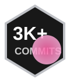
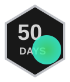
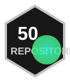
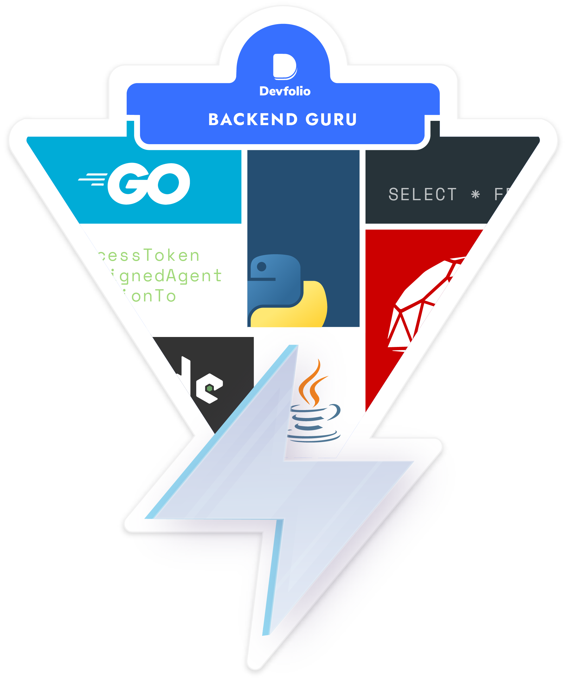
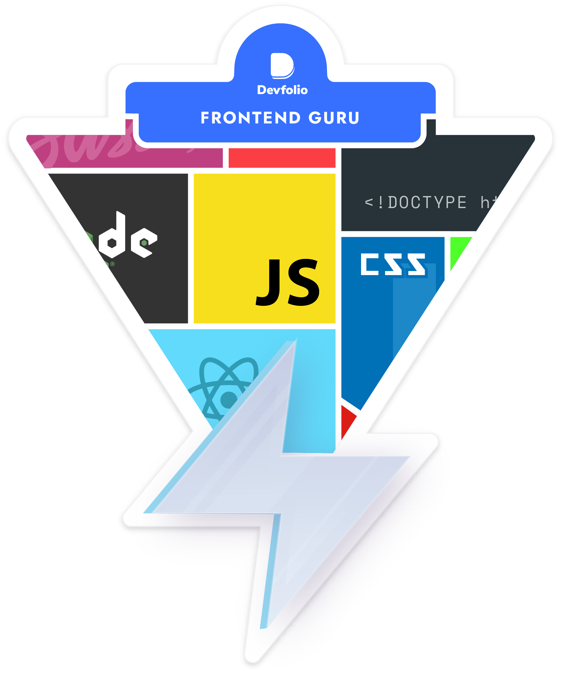

<p align="center">
  
</p>


<div align="center">

[](https://github.com/mohittiwari98)
[](https://github.com/mohittiwari98?tab=followers)
[](https://github.com/mohittiwari98)
[](mailto:mohittiwari17091705@gmail.com)

</div>

---


## 👨‍💻 About Me

```typescript
const mohit = {
  name: "Mohit Tiwari",
  role: "MERN Stack Developer",
  location: "India 🇮🇳",
  currentFocus: ["React", "TypeScript", "AI/ML"],
  learning: "Full Stack Development with AI",
  askMeAbout: ["React", "Node.js", "MongoDB", "TypeScript"],
  portfolio: "https://mohit45.netlify.app",
  funFact: "I debug in production... just kidding 😅",
  philosophy: "Stay foolish. Stay hungry."
};
```

- 🔭 Currently building with **React & TypeScript**
- 🌱 Exploring **Generative AI** & **Full Stack with AI**
- 🏆 **Smart India Hackathon** cleared | **3rd Prize** Dept. Project Competition
- 💬 Ask me about **MERN Stack, React Native, AI prompting**
- 📫 **mohittiwari17091705@gmail.com**
- 🌐 **[mohit45.netlify.app](https://mohit45.netlify.app)**

<br clear="right"/>

---

## 🚀 Featured Projects

<div align="center">

| Project | Description | Tech Stack | Links |
|---------|-------------|------------|-------|
| 🗺️ **Field Attendance Tracker** | Mobile app with real-time geolocation, timestamped attendance & history | `React Native` `TypeScript` `MySQL` `ArcGIS` | [📱 App](#) |
| 🤖 **AI Prompt Toolkit** | 50+ optimized prompts + dataset analysis — improved accuracy by 35% | `Python` `R` `Google SlidesAI` | [🔗 Repo](#) |
| 🌐 **Portfolio Website** | Personal portfolio with projects, experience & skills showcase | `React` `Tailwind CSS` `Vite` | [🌍 Live](https://mohit45.netlify.app) |
| 👁️ **YOLOv8 Object Detection** | Real-time detection pipeline integrated with GeoServer for spatial mapping | `Python` `YOLOv8` `Roboflow` `GeoServer` | [🔗 Repo](#) |

</div>

> 💡 *Replace `#` with your actual GitHub repo URLs!*

---

## 💼 Work Experience

<details open>
<summary><b>🧑‍💻 Frontend Developer Intern — Pinnacle Lab &nbsp; 📅 March 2025 – Present</b></summary>
<br>

- 📱 Built a **React Native** mobile app for field attendance with **real-time geolocation**
- 🧩 Developed dynamic UI with **TypeScript** and **React Navigation** across multiple modules
- 🗺️ Integrated **ArcGIS** and **GeoServer** for spatial data visualization
- 👁️ Deployed **YOLOv8** + **Roboflow** for a computer vision detection pipeline

**Stack:** `TypeScript` `Java` `PHP` `SQL` `React Native` `Android Studio` `Python` `ArcGIS` `YOLOv8` `MySQL`

</details>

<details>
<summary><b>🤖 Generative AI Intern — AI Wallah &nbsp; 📅 May 2025 – June 2025</b></summary>
<br>

- 🎯 Created **20+ impactful presentations** using Google SlidesAI
- 💬 Engineered **50+ optimized AI prompts** for business use cases
- 📊 Analyzed datasets in **R**, improving accuracy by **35%** with insightful visualizations
- 🤝 Collaborated with **5+ cross-functional teammates** on aligned deliverables

**Stack:** `R` `Python` `Google SlidesAI` `Data Visualization`

</details>

---

## 🛠️ Tech Arsenal

<h3 align="center">⚡ Languages</h3>
<p align="center">
  
</p>

<h3 align="center">🎨 Frontend</h3>
<p align="center">
  
</p>

<h3 align="center">⚙️ Backend & Databases</h3>
<p align="center">
  
</p>

<h3 align="center">🧠 AI / Data Science</h3>
<p align="center">
  
  &nbsp;
  
  
  
</p>

<h3 align="center">🔧 DevTools & Platforms</h3>
<p align="center">
  
</p>

---

## 📊 GitHub Analytics

<p align="center">
  
  
</p>

<p align="center">
  
</p>

<p align="center">
  
</p>

<p align="center">
  <a href="https://github.com/mohittiwari98">
    
  </a>
</p>


---

## 🏆 Trophies & Milestones

<p align="center">
  
</p>

<div align="center">

### 🎖️ Achievement Badges

| 🔥 3k+ Commits | ⚡ 50 Day Streak | 📦 50 Repositories | ⭐ 500+ Stars |
|:-:|:-:|:-:|:-:|
|  |  |  |  |

| 🌸 August | ☀️ July | 🌿 June |
|:-:|:-:|:-:|
|  |  |  |

</div>

---

## 📈 Deep Stats

<p align="center">
  
</p>

<p align="center">
  
  &nbsp;
  
</p>

<p align="center">
  
  &nbsp;
  
</p>

---

## 🧩 LeetCode & Competitive Programming

<p align="center">


  
  
</p>

<p align="center">
  <a href="https://codeforces.com/profile/mohit98">
    
  </a>
  &nbsp;
  <a href="https://auth.geeksforgeeks.org/user/mt691uwbt">
    
  </a>
</p>

---

---

## 🎓 Certifications & Achievements

<div align="center">

| 🏅 Achievement | Details |
|:---|:---|
| 🏆 Smart India Hackathon | Cleared internal round |
| 🥉 Departmental Project Competition | 3rd Prize — Dept. of CSIT |
| 📜 Frontend Development | Certified |
| 📜 MySQL | Certified |
| 📜 Hands-on IoT | University of Illinois, Coursera |
| 🤖 Generative AI | AI Wallah Internship Certified |

</div>

<p align="center">
  
  &nbsp;&nbsp;
  
</p>

---

## 🌐 Connect With Me

<p align="center">
  <a href="https://github.com/mohittiwari98">
    
  </a>
  <a href="https://www.linkedin.com/in/mohit-tiwari-mohit98a">
    
  </a>
  <a href="mailto:mohittiwari17091705@gmail.com">
    
  </a>
  <a href="https://mohit45.netlify.app">
    
  </a>
</p>

<p align="center">
  <a href="https://youtube.com/@glamorien">
    
  </a>
  <a href="https://leetcode.com/5esw2XPDHW">
    
  </a>
  <a href="https://codeforces.com/profile/mohit98">
    
  </a>
</p>


---

<picture>
  <source media="(prefers-color-scheme: dark)" srcset="https://raw.githubusercontent.com/tobiasmeyhoefer/tobiasmeyhoefer/output/github-snake-dark.svg" />
  <source media="(prefers-color-scheme: light)" srcset="https://raw.githubusercontent.com/tobiasmeyhoefer/tobiasmeyhoefer/output/github-snake.svg" />
  
</picture>

<div align="center">
  
  <br/>
  <b>⭐ If you find my work useful, consider starring my repos — it really motivates me! ⭐</b>
  <br/><br/>
</div>


